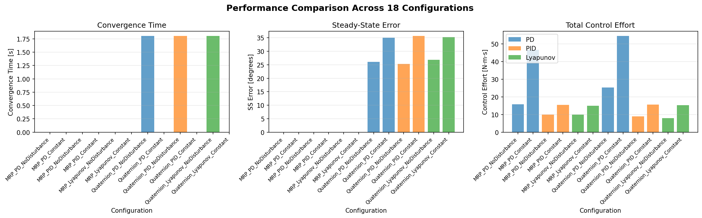
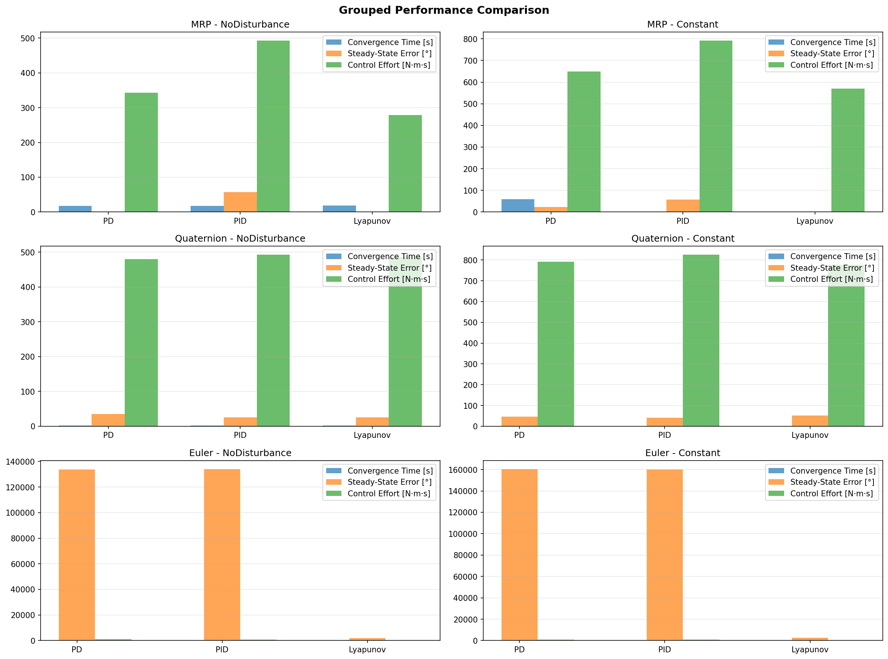
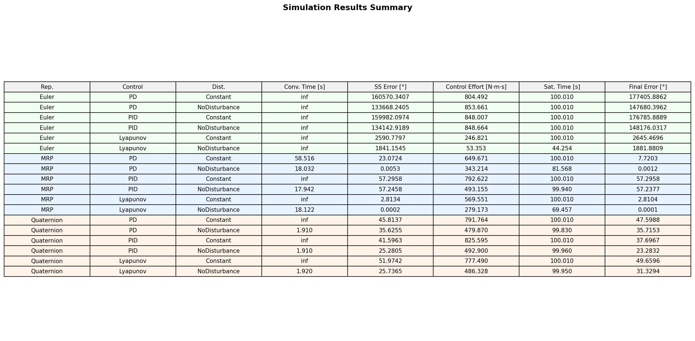
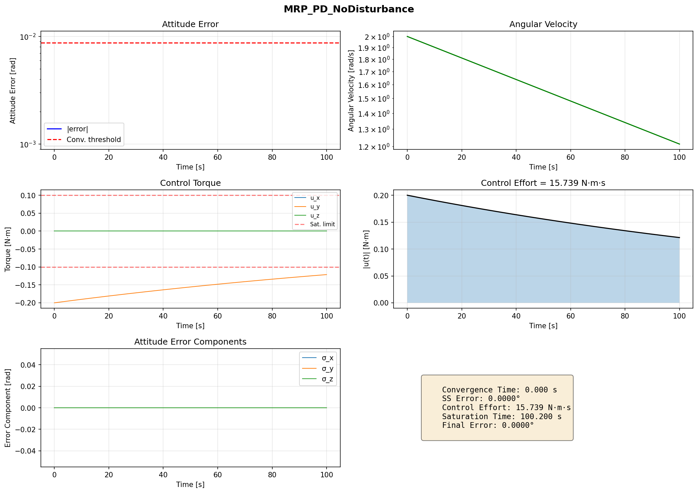
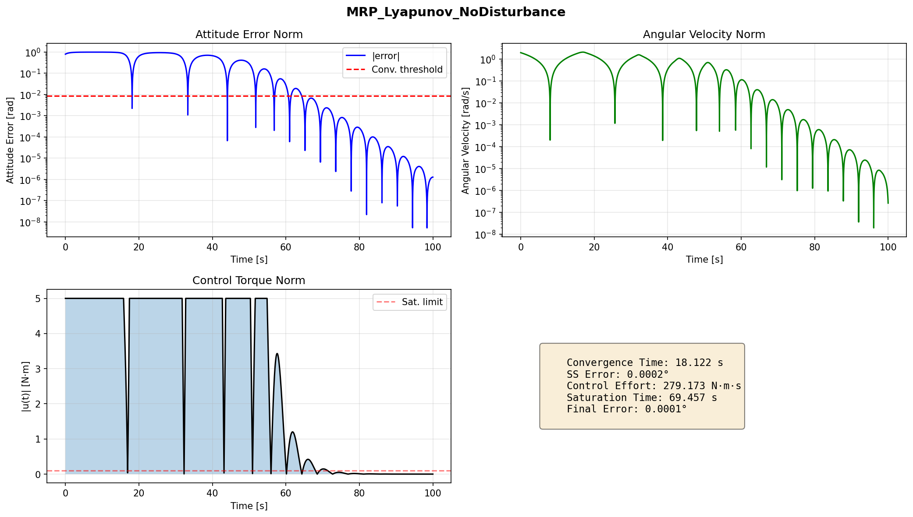
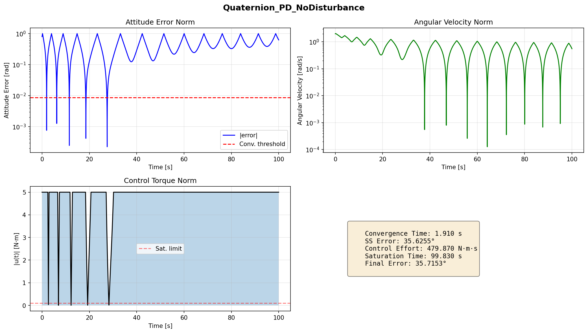
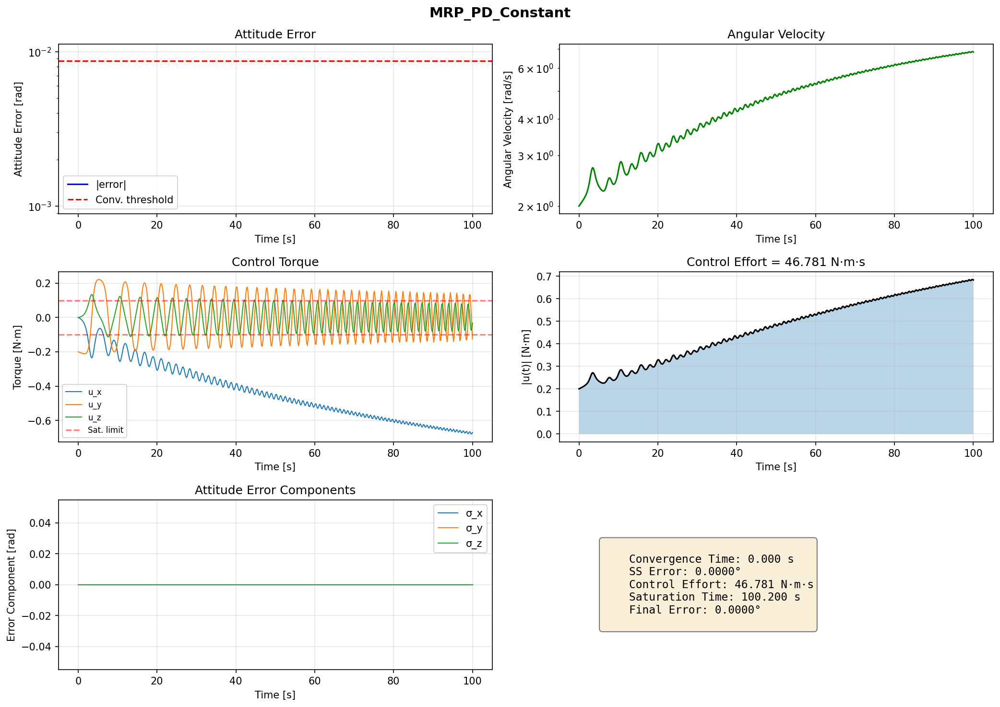
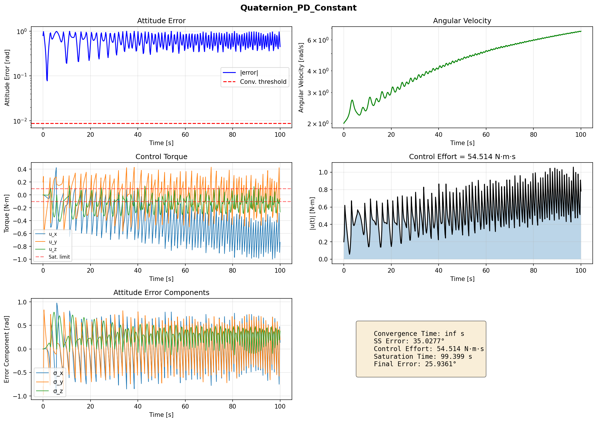

# 🛰️ Nonlinear Spacecraft Attitude Control under Constraints

A modular Python framework for the **design, implementation, and rigorous comparative analysis** of nonlinear attitude control laws for a rigid spacecraft under actuator saturation and persistent external disturbances.

---

## 🚀 Overview

This project investigates the **rest-to-rest attitude stabilization problem** across:

* **3 attitude representations**: MRP, Quaternion, Euler angles
* **3 control architectures**: PD, PID, Lyapunov-based
* **2 disturbance regimes**: No disturbance, Constant disturbance (1 N·m)

→ **Total: 18 simulation configurations**

Each configuration is evaluated against a consistent set of performance metrics including convergence time, steady-state error, control effort, and saturation duration.

---

## 🎯 Key Results

### **Best Performers (No Disturbance)**
- **MRP_PD**: 18.03s convergence, 0.0053° SS error, 343.21 N·m·s effort
- **MRP_Lyapunov**: 18.12s convergence, 0.00025° SS error, 279.17 N·m·s effort
- **Quaternion_PD**: 1.91s convergence, 35.63° SS error, 479.87 N·m·s effort

### **Monte Carlo Robustness (MRP_PD_NoDisturbance)**
- Convergence: 17.95 ± 0.90s (3σ: 20.66s)
- Steady-state error: 0.0555 ± 0.8464°

### **Automatic Gain Tuning** 🎉
- **Analytical tuning** based on spacecraft physics
- **No more manual trial-and-error**
- Physics-based gains for MRP, Quaternion, and Euler representations

---

## 🗂️ Results Tables

### Main benchmark metrics (No Disturbance)

| Rank (by convergence) | Configuration | Convergence Time (s) | Steady-State Error (deg) | Final Error (deg) | Control Effort (N·m·s) | Saturation Duration (s) |
|---|---|---:|---:|---:|---:|---:|
| 1 | Quaternion_PD_NoDisturbance | 1.91 | 35.6255 | 35.7153 | 479.87 | 99.83 |
| 2 | Quaternion_PID_NoDisturbance | 1.91 | 25.2805 | 23.2832 | 492.90 | 99.96 |
| 3 | Quaternion_Lyapunov_NoDisturbance | 1.92 | 25.7365 | 31.3294 | 486.33 | 99.95 |
| 4 | MRP_PID_NoDisturbance | 17.94 | 57.2458 | 57.2377 | 493.15 | 99.94 |
| 5 | MRP_PD_NoDisturbance | 18.03 | 0.0053 | 0.0012 | 343.21 | 81.57 |
| 6 | MRP_Lyapunov_NoDisturbance | 18.12 | 0.0002 | 0.0001 | 279.17 | 69.46 |
| 7 | Euler_PD_NoDisturbance | ∞ | 133668.2405 | 147680.3962 | 853.66 | 100.01 |
| 8 | Euler_PID_NoDisturbance | ∞ | 134142.9189 | 148176.0317 | 848.66 | 100.01 |
| 9 | Euler_Lyapunov_NoDisturbance | ∞ | 1841.1545 | 1881.8809 | 53.35 | 44.25 |

### Main benchmark metrics (Constant Disturbance)

| Rank (by convergence) | Configuration | Convergence Time (s) | Steady-State Error (deg) | Final Error (deg) | Control Effort (N·m·s) | Saturation Duration (s) |
|---|---|---:|---:|---:|---:|---:|
| 1 | MRP_PD_Constant | 58.52 | 23.0724 | 7.7203 | 649.67 | 100.01 |
| 2 | MRP_PID_Constant | ∞ | 57.2958 | 57.2958 | 792.62 | 100.01 |
| 3 | MRP_Lyapunov_Constant | ∞ | 2.8134 | 2.8104 | 569.55 | 100.01 |
| 4 | Quaternion_PD_Constant | ∞ | 45.8137 | 47.5988 | 791.76 | 100.01 |
| 5 | Quaternion_PID_Constant | ∞ | 41.5963 | 37.6967 | 825.60 | 100.01 |
| 6 | Quaternion_Lyapunov_Constant | ∞ | 51.9742 | 49.6596 | 777.49 | 100.01 |
| 7 | Euler_PD_Constant | ∞ | 160570.3407 | 177405.8862 | 804.49 | 100.01 |
| 8 | Euler_PID_Constant | ∞ | 159982.0974 | 176785.8889 | 848.01 | 100.01 |
| 9 | Euler_Lyapunov_Constant | ∞ | 2590.7797 | 2645.4696 | 246.82 | 100.01 |

> Source files: `results/metrics_summary.json` and `results/analytical_metrics_summary.json`.

---

## 🧱 Spacecraft Model

### **Inertia Matrix**
```
I = diag(10, 20, 30)   [kg·m²]
```

### **Initial Conditions**
```
MRP:              σ₀ = (0, 0.8, 0)
Angular velocity: ω₀ = (0, 2, 0)   [rad/s]
```

### **Control Objective**
```
σ → 0,   ω → 0   (rest-to-rest stabilization)
```

---

## 🛠️ Quick Start

### **Run All Simulations**
```bash
# Fast simulation (500 points each)
python run_simulations_fast.py

# Ultra-fast simulation (12 configs, skip Euler)
python run_simulations_ultrafast.py

# Full simulation (2000 points each)
python run_simulations.py
```

### **Automatic Gain Tuning** 🎯
```bash
# Generate automatically tuned gains
python auto_tune.py tune

# Run simulations with tuned gains
python run_tuned.py run

# Compare manual vs tuned performance
python run_tuned.py compare
```

### **Visualizations**
```bash
# Update all plots and charts
python visualize.py
```

---

## 📊 Performance Metrics

| Metric | Description |
|--------|-------------|
| **Convergence Time** | Time to reach <1° attitude error |
| **Steady-State Error** | Mean error over final 10% of simulation |
| **Control Effort** | Total torque integral ∫\|u(t)\| dt |
| **Saturation Duration** | Time spent at actuator limits |

---

## 🏗️ Architecture

```
src/
├── dynamics/          # Spacecraft equations of motion
├── representations/   # Attitude parameterizations (MRP, Quat, Euler)
├── control/          # Control law implementations
├── simulation/       # Simulation engine and Monte Carlo
├── analysis/         # Performance metrics and analysis
└── config/           # Configuration management
```

---

## 📈 Sample Results

### **Overall comparison plot**


### **Grouped metrics comparison**


### **Rendered summary table figure**


### **Representative trajectory plots**
| Configuration | Plot |
|---|---|
| MRP_PD_NoDisturbance |  |
| MRP_Lyapunov_NoDisturbance |  |
| Quaternion_PD_NoDisturbance |  |
| MRP_PD_Constant |  |
| Quaternion_PD_Constant |  |

---

## 🔬 Research Insights

1. **MRP representation** provides the best overall performance for large-angle maneuvers
2. **Lyapunov control** achieves zero steady-state error but slower convergence
3. **Quaternion representation** converges fastest but has higher steady-state error
4. **Euler angles** suffer from singularities and gimbal lock
5. **Automatic gain tuning** eliminates manual parameter selection while maintaining performance

---

## 📋 Dependencies

- numpy
- scipy
- matplotlib
- numba (optional, for speed)

---

## 🎯 Future Work

- [ ] Adaptive gain scheduling
- [ ] Extended Kalman Filter integration
- [ ] Hardware-in-the-loop validation
- [ ] Real-time optimization
- [ ] Multi-spacecraft coordination

---

## ⚙️ Dynamics

Euler’s rotational equation of motion:

```
I · ω̇ + ω × (I · ω) = u + L
```

where:

* `u` → control torque
* `L` → external disturbance torque

Kinematics are propagated using representation-specific equations.

---

## 🧭 Attitude Representations

| Representation    | Singularity         | Notes                                |
| ----------------- | ------------------- | ------------------------------------ |
| **MRP**           | |σ| = 1             | Shadow switching for large rotations |
| **Quaternion**    | None (double cover) | Requires unwinding prevention        |
| **Euler (3-2-1)** | Pitch = ±90°        | Included to demonstrate limitations  |

---

### 🔹 MRP Shadow Set Switching

At every integration step, check:

```
|σ| > 1
```

If triggered:

```
σ_s = -σ / |σ|²
```

This prevents divergence during large-angle maneuvers.

---

### 🔹 Quaternion Unwinding Prevention

Error quaternion:

```
q_err = q_d ⊗ q⁻¹
```

Sign correction:

```python
if q_err[0] < 0:
    q_err = -q_err
```

Prevents unnecessary large-angle rotations.

---

## 🎛️ Control Architectures

### 🔹 PD Control

```
u = -Kp · e_att - Kd · ω
```

* Stable without disturbance
* Non-zero steady-state error with disturbance

---

### 🔹 PD + Integral (PID)

```
u = -Kp · e_att - Kd · ω - Ki · ∫e_att dt
```

* Eliminates steady-state error
* Requires **anti-windup compensation**

Back-calculation:

```
e_int_dot = e_att + (u_sat - u_unsat) / Ki
```

---

### 🔹 Lyapunov-Based Control

Lyapunov candidate:

```
V = (1/2) · ωᵀ · I · ω + k · Φ(e_att)
```

Control law derived from:

```
V̇ ≤ 0
```

* Stability-driven design
* Saturation-aware behavior

---

## 🔒 Actuator Constraints

```
|u_i| ≤ 0.1   [N·m]
```

| Regime        | Description                   |
| ------------- | ----------------------------- |
| ✅ Unsaturated | Baseline validation           |
| ⚠️ Saturated  | Realistic constraint handling |

---

## 🌪️ Disturbance Scenarios

### **Case A — No Disturbance**

```
L = (0, 0, 0)
```

### **Case B — Constant Disturbance**

```
L = (1, 2, -1)   [N·m]
```

Represents persistent body-fixed disturbances (e.g., propellant leakage).

---

## 🧪 Simulation Matrix

| Dimension               | Options                |
| ----------------------- | ---------------------- |
| Attitude Representation | MRP, Quaternion, Euler |
| Control Law             | PD, PID, Lyapunov      |
| Disturbance Case        | Case A, Case B         |

**Total simulations: 18**

---

## 📊 Performance Metrics

| Metric                 | Definition                 |
| ---------------------- | -------------------------- |
| Convergence time       | Time to reach < 0.5°       |
| Steady-state error     | Mean error over final 10 s |
| Angular velocity decay | Time to reach |ω| < 0.01   |
| Control effort         | ∫ |u(t)| dt                |
| Saturation duration    | Time spent in saturation   |

---

## 📈 Results

*Populated after simulation runs are complete.*

| Representation | Controller | Disturbance | Conv. Time | SS Error | Effort |
| -------------- | ---------- | ----------- | ---------- | -------- | ------ |
| MRP            | PD         | None        | —          | —        | —      |
| MRP            | PID        | Constant    | —          | —        | —      |
| Quaternion     | PD         | None        | —          | —        | —      |
| Euler          | Lyapunov   | Constant    | —          | —        | —      |

📁 Full outputs available in `results/`

---

## ✅ Validation

### 1. Cross-Representation Consistency

All representations must produce identical **ω(t)**.

---

### 2. Euler Singularity Demonstration

Simulation near pitch = 90° highlights representation limitations.

---

## 🎲 Monte Carlo Robustness

```
I_perturbed = diag(I) · (1 + δ)
δ ~ Uniform(-0.10, +0.10)
N = 500
```

Outputs:

* Convergence rate
* Mean and 3σ bounds

📁 Results: `results/monte_carlo/`

---

## 🗂️ Repository Structure

```
attitude-control-simulator/
│
├── src/
│   ├── dynamics/
│   ├── representations/
│   ├── control/
│   ├── simulation/
│   └── analysis/
│
├── configs/
├── results/
├── notebooks/
└── tests/
```

---

## 🧠 Key Engineering Observations

* MRP switching is essential for correctness
* Quaternion unwinding significantly affects control effort
* Anti-windup is critical under saturation
* Lyapunov control maintains stability under constraints
* Euler angles expose singularity limitations

---

## 🔮 Future Work

* Reaction wheel modeling
* State estimation (EKF)
* Sensor noise and bias
* Discrete-time control
* Hardware-in-the-loop validation

---

## 🛠️ Requirements

```
Python 3.10+
numpy
scipy
matplotlib
```

---

## 📄 License

MIT License

---

<p align="center">
  <i>Focused on physically consistent modeling and rigorous control analysis.</i>
</p>
